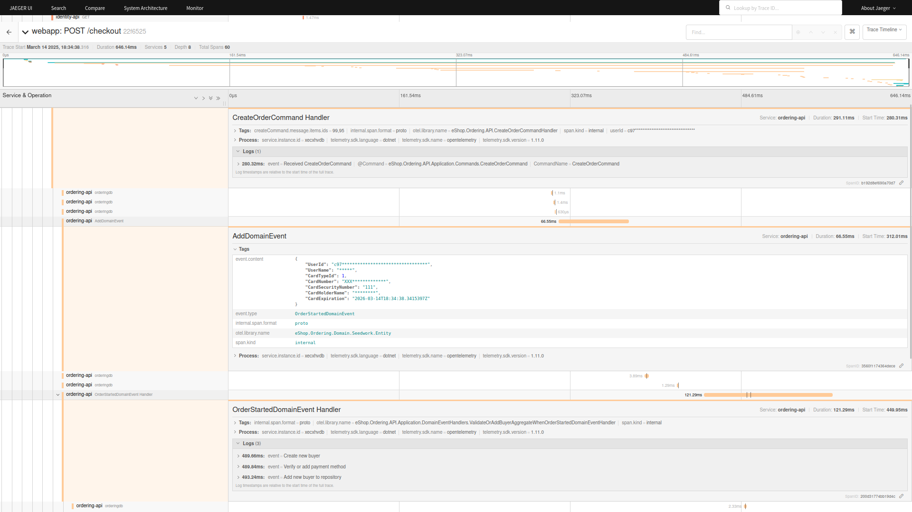

# Integrating OpenTelemetry & Security in eShop

## Initial Remarks
### Author and Github Repository
This work was carried out by **Miguel Figueiredo (NMec: 108287)** as part of the Software Architectures course curriculum. The repository that includes the implementation code can be found at the following link: [eShop_AS_108287](https://github.com/Migas77/eShop_AS_108287). If there is any issue regarding the implementation and contents of this record contact me through this email: ``miguel.belchior@ua.pt``.

### How to build and run the eShop environment (including jaeger, prometheus and grafana)

The eShop environment uses containerized services for Jaeger, Prometheus, and Grafana to enable distributed tracing, monitoring, and data visualization. These services run in separate Docker containers, and to launch the application, you'll need to use the provided .NET command.


#### Jaeger Setup
```bash
docker run -d --name jaeger-assignment-1   -e COLLECTOR_ZIPKIN_HOST_PORT=:9411   -e COLLECTOR_OTLP_ENABLED=true   -p 6831:6831/udp   -p 6832:6832/udp   -p 5778:5778   -p 16686:16686   -p 4317:4317   -p 4318:4318   -p 14250:14250   -p 14268:14268   -p 14269:14269   -p 9411:9411   jaegertracing/all-in-one:1.35
```

#### Prometheus Setup
```basg
docker run -d \
  -p 9090:9090 \
  -p 8888:8888 \
  -v $(pwd)/datasources/prometheus_config.yml:/etc/prometheus/prometheus.yml \
  prom/prometheus
```

#### Grafana Setup
```bash
docker run -d -p 3000:3000 \
  -v $(pwd)/datasources/jaeger.yml:/etc/grafana/provisioning/datasources/jaeger.yml \
  -v $(pwd)/datasources/prometheus.yml:/etc/grafana/provisioning/datasources/prometheus.yml \
  -v $(pwd)/dashboards:/var/lib/grafana/dashboards \
  -v $(pwd)/dashboards/dashboards.yml:/etc/grafana/provisioning/dashboards/dashboards.yml \
  grafana/grafana
```


#### Application Setup
```powershell
dotnet run --project src/eShop.AppHost/eShop.AppHost.csproj
```

## Introduction

The goal of this project was to integrate OpenTelemetry tracing into a single feature of an [eShop e-commerce system](https://github.com/dotnet/eShop) while ensuring security best practices. The key objectives included:

  - **Implement OpenTelemetry tracing** on a single feature or use-case (end-to-end).
  - **Mask or exclude sensitive data** (e.g., email, payment details) from telemetry and logs.
  - **Set up a basic Grafana dashboard** to visualize the traces and metrics.
  - (Optional Extras) **Explore data encryption and compliance** in the database layer and introduce **column masking** for sensitive data

I've focused my implementation on the **checkout/place order feature**. The feature requires the user to be authenticated to place an order with the items that are present on the basket, which is stored server-side.

## Sequence Diagram - Checkout Flow
Before diving into the actual implementation is important to note the following sequence diagram highlighting the full flow of the **checkout/place order feature**. Only interactions between services, event bus and databases are showcased in this sequence diagram with processing inside each of the services being omitted (such as commands and domain events - only integration events that pass through the event bus are shown). Thus, the checkout flow present in the following sequence diagram can be divided in the following steps:
1. The user initiates the checkout process by sending a ``POST /checkout`` request through the ``webapp``.
2. The ``webapp`` sends a POST request ``BasketApi.Basket/GetBasket`` to the ``basket-api`` service to retrieve the user's basket. The ``basket-api`` retrieves the basket details from the ``basketdb`` and responds with the user's basket information.
3. Afterwards, the ``webapp`` makes a ``GET /api/catalog/items/by`` request to the ``catalog-api`` to fetch details of the items in the basket. Then, the ``catalog-api`` retrieves the catalog data from ``catalogdb`` and returns the relevant product details.
4. With the basket and catalog data, the ``webapp`` sends a ``POST /api/orders/`` request to the ``ordering-api`` to create a new order. Consequently, the ``ordering-api`` saves the order into the ``orderingdb`` and publishes an ``OrderStartedIntegrationEvent`` to the ``eventbus``, notifying the beginning of the order.
5. The ``basket-api`` receives the ``OrderStartedIntegrationEvent`` through the ``eventbus`` and proceeds to unlink the user's basket (UNLINK operation from REDIS).
6. The ``ordering-api`` then publishes another event, ``OrderStatusChangedToSubmittedIntegrationEvent``, indicating that the order has moved to the submitted status.
7. Finally, the ``webapp`` receives the ``OrderStatusChangedToSubmittedIntegrationEvent`` and sends a ``POST /BasketApi.Basket/DeleteBasket`` request to delete the user's basket, which is then carried out by the ``basketdb`` with the unlink operation.


## Tracing 

Although the eCommerce application with an aspire implementation already provides a dashboard with the full list of resources, console, structured logs, **traces** and metrics, I've configured **Jaeger**, which is a distributed tracing platform. The configuration was achieved by the following code on [eShop.ServiceDefaults/Extensions.cs file](https://github.com/Migas77/eShop_AS_108287/blob/main/src/eShop.ServiceDefaults/Extensions.cs#L105). Bear in mind the configuration and specification of **CUSTOM_OTEL_EXPORTER_OTLP_ENDPOINT** environment variable present in the [eShop.AppHost/Properties/launchSettings.json file line 14](https://github.com/Migas77/eShop_AS_108287/blob/main/src/eShop.AppHost/Properties/launchSettings.json#L14), specifying the Jaeger OTel endpoint.

```c#
# eShop.ServiceDefaults/Extensions.cs
private static IHostApplicationBuilder AddOpenTelemetryExporters(this IHostApplicationBuilder builder)
{
  var useOtlpExporter = !string.IsNullOrWhiteSpace(builder.Configuration["OTEL_EXPORTER_OTLP_ENDPOINT"]);
  if (useOtlpExporter)
  {
    builder.Services.ConfigureOpenTelemetryLoggerProvider(logging => logging.AddProcessor<DataMaskingLogsProcessor>().AddOtlpExporter());
    builder.Services.ConfigureOpenTelemetryMeterProvider(metrics => metrics.AddOtlpExporter());
    builder.Services.ConfigureOpenTelemetryTracerProvider(tracing => tracing.AddProcessor<DataMaskingActivityProcessor>().AddOtlpExporter());
  }

  var useCustomOtlpExporter = !string.IsNullOrWhiteSpace(builder.Configuration["CUSTOM_OTEL_EXPORTER_OTLP_ENDPOINT"]);
  if (useCustomOtlpExporter)
  {   
    var endpoint = builder.Configuration["CUSTOM_OTEL_EXPORTER_OTLP_ENDPOINT"];
    builder.Services.ConfigureOpenTelemetryLoggerProvider(logging => logging.AddOtlpExporter(options => options.Endpoint = new Uri(endpoint!)));
    builder.Services.ConfigureOpenTelemetryTracerProvider(tracing => tracing.AddOtlpExporter(options => options.Endpoint = new Uri(endpoint!)));
    builder.Services.ConfigureOpenTelemetryMeterProvider(metrics => metrics.AddOtlpExporter(options => options.Endpoint = new Uri(endpoint!)));
  }

  builder.Services.ConfigureOpenTelemetryMeterProvider(metrics => metrics.AddPrometheusExporter());

  return builder;
}
``` 
```json
{
  "$schema": "http://json.schemastore.org/launchsettings.json",
  "profiles": {
    "https": {
      "commandName": "Project",
      "dotnetRunMessages": true,
      "launchBrowser": true,
      "applicationUrl": "https://localhost:19888;http://localhost:18848",
      "environmentVariables": {
        "ASPNETCORE_ENVIRONMENT": "Development",
        "DOTNET_ENVIRONMENT": "Development",
        "DOTNET_DASHBOARD_OTLP_ENDPOINT_URL": "https://localhost:18076",
        "DOTNET_RESOURCE_SERVICE_ENDPOINT_URL": "https://localhost:19076",
        "CUSTOM_OTEL_EXPORTER_OTLP_ENDPOINT": "http://localhost:4317"
      }
    }
  }
}
``` 

The Jaeger was configured to collect the traces, spans/activities and tags of all the application's services. The following images, showcase the full trace for the checkout use case. As the full trace is very extensive I've tried throghout the implementation to reuse already created activities for the new introduced tags. However, as you'll later see I've also added new activities. In this section, I'll make an explanation of the full checkout trace. I'll include images for easier explanation but the full trace exported from jaeger is also present [here](https://github.com/Migas77/eShop_AS_108287/blob/main/checkout-trace.json) if the reader wants to view it in its own dashboard.

The next figure, showcases **custom created tags related to the checkout process**: 
- basket.checkout.latency - latency of the checkout request/flow.
- basket.items - tuples regarding the state of the basket with (product_id, product_quantity, product_price).
- basket.items.unique.count - the number of different/unique items in the basket.
- basket.requestId - the requestId.
- basket.total - the total price of the basket.
- buyerId - the userId corresponding to the buyer. As you can see, the information for the buyerId is masked (c97*********************************). Later, the process of masking this and other tags will also be explained.

There are also other tags, already provided in the aspire implementation such as "url.path". It's also important to note the **use of events** to pinpoint/mark/record important events that provide additional context about what happened within the span's execution (in this case, I provide a simple event - "Get Basket Async").


The first part of the trace is constitued by a POST request to the BasketApi.Basket/GetBasket endpoint. Yet again, there are defined custom tags basket.items and basket.items.unique.count, representing the id and quantity of each item in the basket and the number of different items in the basket, respectively — these simple custom tags are present throghout the whole trace and, therefore, I'll refrain from explicitely enumerating them again so not to extend the size of this report. As previously, there are also defined two subsequent events showcasing when the get basket request was made and when an not empty basket was found. It's also possible to verify the **end-to-end nature of the trace**, which starts in the webapp, goes through the basket-api service and onto the redis database to retrieve the basket items.


Bellow, it's provided a code snippet (from file [src/Basket.API/Grpc/BasketService.cs](https://github.com/Migas77/eShop_AS_108287/blob/main/src/Basket.API/Grpc/BasketService.cs)) for the creation of said tags and events within a pre-existing activity (Activity.Current).

```c#
public override async Task<CustomerBasketResponse> GetBasket(GetBasketRequest request, ServerCallContext context)
{
  var activity = Activity.Current;
  var userId = context.GetUserIdentity();
  activity?.SetTag("userId", userId);
  activity?.AddEvent(new("Get Basket"));

  if (string.IsNullOrEmpty(userId))
  {
    activity?.AddEvent(new("User is not authenticated"));
    return new();
  }

  if (logger.IsEnabled(LogLevel.Debug))
  {
    logger.LogDebug("Begin GetBasketById call from method {Method} for basket id {Id}", context.Method, userId);
  }

  var data = await repository.GetBasketAsync(userId);

  if (data is not null)
  {
    var customerBasket = MapToCustomerBasketResponse(data);
    activity?.SetTag("basket.items", string.Join(";", customerBasket.Items.Select(i => $"({i.ProductId},{i.Quantity})")));
    activity?.SetTag("basket.items.unique.count", customerBasket.Items.Count);
    activity?.AddEvent(new("Not Empty Basket Found"));
    return customerBasket;
  }

  activity?.AddEvent(new("Empty Basket or Basket Not Found"));
  return new();
}
```

At Figure 4, it's possible to observe the next steps of the checkout flow:
1. The webapp performs a request to the catalog-api to retrieve information about the purchased catalog items (tags catalog.ids and catalog.items). The trace also shows the request to the postgres catalogdb database, following the webapp initial request.
2. Then, the webapp performs a POST request on ordering-api's /api/orders endpoint to carry out the purchase. Following this request, there are two requests from the ordering-api to the identity-api. However, as these are not constant (not always present) throghout multiple checkout requests, I will not comment further on them. Next, it's shown a custom activity created by me for when a CreateOrderCommand is published. In this CreateOrderCommand we can see once again custom tags with masking of userId tag. Span Events were also created and can be checked out on Figure 5.


One important concern is to explicitely register all the events throughout the checkout process. The function AddDomainEvent present in the [Entity.cs file](https://github.com/Migas77/eShop_AS_108287/blob/main/src/Ordering.Domain/SeedWork/Entity.cs#L28) was the ideal place to register all Domain Events (in a new activity). Once again, sensitive information as UserId, UserName, CardNumber and CardHolderName were also masked. Bear in mind that '*' corresponds to the used masking character and X was present on the credit card number of said user, as presented in the code snippet bellow and the following [file](https://github.com/Migas77/eShop_AS_108287/blob/main/src/Identity.API/UsersSeed.cs#L12).

At the image, we can also conclude that the OrderStartedDomainEvent (present in event.type tag) is handled by an event handler (last trace), with the following events being registered: "Create new buyer", "Verify or add payment method" and "Add new buyer to repository".
	


```c# 
// Ordering.Domain/SeedWork/Entity.cs
public void AddDomainEvent(INotification eventItem)
{
  using var activity = _activitySource.StartActivity("AddDomainEvent");
  activity?.SetTag("event.type", eventItem.GetType().Name);
  activity?.SetTag("event.content", JsonConvert.SerializeObject(eventCopy));
  _domainEvents = _domainEvents ?? new List<INotification>();
  _domainEvents.Add(eventItem);
}
```

```c#
// Identity.API/UsersSeed.cs
alice = new ApplicationUser
{
  UserName = "alice",
  Email = "AliceSmith@email.com",
  EmailConfirmed = true,
  CardHolderName = "Alice Smith",
  CardNumber = "XXXXXXXXXXXX1881",
  CardType = 1,
  City = "Redmond",
  Country = "U.S.",
  Expiration = "12/24",
  Id = Guid.NewGuid().ToString(),
  LastName = "Smith",
  Name = "Alice",
  PhoneNumber = "1234567890",
  ZipCode = "98052",
  State = "WA",
  Street = "15703 NE 61st Ct",
  SecurityNumber = "123"
};
```



Other domain events and domain event handlers are traced, until the order is started. Once this occurs, the ordering-api publishes OrderStartedIntegrationEvent to the rabbitmq event bus (Figure 6). This is also traced, as well as the receipt of the corresponding integration event on the basket-api. In both message tags, the userId value is also masked. This integration event is sent to the basket-api with the goal of deleting the basket. The integration event is then handled by a pre-configured handler, which is also traced (userId is once again masked). Afterwards, the deletion of the basket is carried out visible by the UNLINK Redis operation.


As the order is submitted, an OrderStatusChangedToSubmittedIntegrationEvent is sent through rabbitmq event bus, by the ordering-api to the webapp. Once again, PII information, such as BuyerName, BuyerIdentityGuid and buyerId are also masked.


Finally, the webapp makes a POST request to BasketAPI.Basket/DeleteBasket in order to delete the basket. As previously, this request is traced from the webapp until the REDIS database UNLINK operation.


As it's possible to conclude, the feature is traced end-to-end and full flow corresponds to the one highlighted on the sequence diagram.

## Metrics

Metrics are essential for observability, providing quantitative insights into system performance, resource utilization, and application health. With this in mind, I've configured Prometheus a widely used open-source monitoring system, which collects and stores metrics using a time-series database. In order to achieve this, I had to make the following changes in the configuration file [eShop.ServiceDefaults/Extensions.cs](https://github.com/Migas77/eShop_AS_108287/blob/main/src/eShop.ServiceDefaults/Extensions.cs#L114):
- add line ``builder.Services.ConfigureOpenTelemetryMeterProvider(metrics => metrics.AddPrometheusExporter());`` to configure prometheus exporter for metrics;
- uncomment line ``app.MapPrometheusScrapingEndpoint();``  to enable scrape endpoints for each service, allowing Prometheus to collect the metrics.


```c#
private static IHostApplicationBuilder AddOpenTelemetryExporters(this IHostApplicationBuilder builder)
{
  // ...

  var useCustomOtlpExporter = !string.IsNullOrWhiteSpace(builder.Configuration["CUSTOM_OTEL_EXPORTER_OTLP_ENDPOINT"]);
  if (useCustomOtlpExporter)
  {   
      var endpoint = builder.Configuration["CUSTOM_OTEL_EXPORTER_OTLP_ENDPOINT"];
      builder.Services.ConfigureOpenTelemetryLoggerProvider(logging => logging.AddOtlpExporter(options => options.Endpoint = new Uri(endpoint!)));
      builder.Services.ConfigureOpenTelemetryTracerProvider(tracing => tracing.AddOtlpExporter(options => options.Endpoint = new Uri(endpoint!)));
      builder.Services.ConfigureOpenTelemetryMeterProvider(metrics => metrics.AddOtlpExporter(options => options.Endpoint = new Uri(endpoint!)));
  }

  builder.Services.ConfigureOpenTelemetryMeterProvider(metrics => metrics.AddPrometheusExporter());

  return builder;
}

// ...

public static WebApplication MapDefaultEndpoints(this WebApplication app)
{
    // Uncomment the following line to enable the Prometheus endpoint (requires the OpenTelemetry.Exporter.Prometheus.AspNetCore package)
    app.MapPrometheusScrapingEndpoint();

    // ...

    return app;
}
```

Furthermore, I had to specify prometheus target and map it to the docker container at the specified path so that It actually gathers the metrics, which is present at the [datasources/prometheus_config.yml file](https://github.com/Migas77/eShop_AS_108287/blob/main/datasources/prometheus_config.yml):

```yml
global:
  scrape_interval: 5s

scrape_configs:
  # HTTPS
  # 'https://localhost:5243', # Identity API HTTPS
  # 'https://localhost:7298', # WebApp HTTPS
  # 'https://localhost:7260'  # Webhooks Client HTTPS
  - job_name: 'eshop-identity-api-https'
    scheme: https
    tls_config:
      insecure_skip_verify: true
    static_configs:
      - targets: ['host.docker.internal:5243']
        labels:
          service: 'identity-api-https'

  - job_name: 'eshop-webapp-https'
    scheme: https
    tls_config:
      insecure_skip_verify: true
    static_configs:
      - targets: ['host.docker.internal:7298']
        labels:
          service: 'webapp-https'

  - job_name: 'eshop-webhooks-client-https'
    scheme: https
    tls_config:
      insecure_skip_verify: true
    static_configs:
      - targets: ['host.docker.internal:7260']
        labels:
            service: 'webhooks-client-https'

  # HTTP
  # ...

```

At the following image, it's provided evidence on the health status of the configured targets. As it's possible conclude, the presented targets are healthy and therefore, prometheus can scrape the corresponding/existing metrics.


The only thing remaining is to present how did I define the open telemetry metrics. In the following code (source: [WebApp/Services/BasketState.cs](https://github.com/Migas77/eShop_AS_108287/blob/main/src/WebApp/Services/BasketState.cs#L16)), I define the meter source and 5 different metrics:
- basket.checkout.value (histogram) - To measure the total value of the items in the basket at checkout.
- basket.checkout.items (histogram) - To measure the number of items at checkout.
- basket.checkout.latency (histogram) - Histogram metric to measure the latency of the checkout/place order flow.
- basket.checkout.success (counter) & basket.checkout.error (counter) - Counters to measure the success/error rate of the checkout process.

These metrics are used/consumed/triggered by calling ``Record`` or ``Add`` functions for the histogram and counter metrics, respectively.

```c#
public class BasketState(
    BasketService basketService,
    CatalogService catalogService,
    OrderingService orderingService,
    AuthenticationStateProvider authenticationStateProvider) : IBasketState
{
  private static readonly Meter _meter = new("eShop.WebApp.BasketState");
  private static readonly Histogram<double> _checkoutValueCounter = _meter.CreateHistogram(
      "basket.checkout.value",
      description: "Value of items in basket at checkout",
      unit: "USD",
      advice: new InstrumentAdvice<double>
      {
          HistogramBucketBoundaries = [ 0, 25, 50, 75, 100, 125, 150, 175, 200, 250, 300, 400, 500, 750, 1000 ]
      }
  );
  private static readonly Histogram<int> _checkoutItemsHistogram = _meter.CreateHistogram(
      "basket.checkout.items",
      description: "Number of items in basket at checkout",
      advice: new InstrumentAdvice<int>
      {
          HistogramBucketBoundaries = [ 0, 1, 2, 3, 4, 5, 7, 10, 15, 20, 25, 30, 40, 50 ]
      }
  );
  private static readonly Histogram<long> checkoutLatencyHistogram = _meter.CreateHistogram(
      "basket.checkout.latency",
      description: "Latency of checkout operation",
      advice: new InstrumentAdvice<long>
      {
          HistogramBucketBoundaries = [ 25, 50, 75, 100, 200, 300, 500, 1000, 2000, 5000, 10000, 30000, 60000, 120000, 300000 ]
      }
  );
  private static readonly Counter<int> _checkoutSuccessCounter = _meter.CreateCounter<int>(
      "basket.checkout.success",
      description: "Number of successful checkouts"
  );

  private static readonly Counter<int> _checkoutErrorCounter = _meter.CreateCounter<int>(
      "basket.checkout.error",
      description: "Number of failed checkouts"
  );

  // ...

  public async Task<bool> CheckoutAsync(BasketCheckoutInfo checkoutInfo)
  {
    var activity = Activity.Current;
    var stopwatch = Stopwatch.StartNew();

    try
    {
      if (checkoutInfo.RequestId == default)
      {
        checkoutInfo.RequestId = Guid.NewGuid();
      }
      activity?.SetTag("basket.requestId", checkoutInfo.RequestId);

      var buyerId = await authenticationStateProvider.GetBuyerIdAsync() ?? throw new InvalidOperationException("User does not have a buyer ID");
      var userName = await authenticationStateProvider.GetUserNameAsync() ?? throw new InvalidOperationException("User does not have a user name");

      activity?.SetTag("buyerId", buyerId);
      activity?.SetTag("userName", userName);

      // Get details for the items in the basket
      var orderItems = await FetchBasketItemsAsync();
      activity?.SetTag("basket.items", string.Join(";", orderItems.Select(i => $"({i.ProductId},{i.Quantity},{i.UnitPrice})")));
      activity?.SetTag("basket.total", orderItems.Sum(i => i.UnitPrice * i.Quantity));

      // Call into Ordering.API to create the order using those details
      var request = new CreateOrderRequest(
          UserId: buyerId,
          UserName: userName,
          City: checkoutInfo.City!,
          Street: checkoutInfo.Street!,
          State: checkoutInfo.State!,
          Country: checkoutInfo.Country!,
          ZipCode: checkoutInfo.ZipCode!,
          CardNumber: "1111222233334444",
          CardHolderName: "TESTUSER",
          CardExpiration: DateTime.UtcNow.AddYears(1),
          CardSecurityNumber: "111",
          CardTypeId: checkoutInfo.CardTypeId,
          Buyer: buyerId,
          Items: [.. orderItems]);

      _checkoutValueCounter.Record((double)orderItems.Sum(i => i.UnitPrice * i.Quantity));
      _checkoutItemsHistogram.Record(orderItems.Sum(i => i.Quantity));

      await orderingService.CreateOrder(request, checkoutInfo.RequestId);
      await DeleteBasketAsync();
      _checkoutSuccessCounter.Add(1);
      long elapsed = stopwatch.ElapsedMilliseconds;
      activity?.SetTag("basket.checkout.latency", elapsed);
      checkoutLatencyHistogram.Record(elapsed);
    }
    catch (Exception ex)
    {
      _checkoutErrorCounter.Add(1);
      long elapsed = stopwatch.ElapsedMilliseconds;
      activity?.SetTag("basket.checkout.latency", elapsed);
      checkoutLatencyHistogram.Record(elapsed);
      activity?.SetStatus(ActivityStatusCode.Error, ex.Message);
      return false;
    }
    
    return true;
  }

  // ...
}
```

Bear in mind that the custom metrics defined by me are not the only ones that are present on both prometheus and grafana dashboards. All the metrics provided by Aspire are also present, as will later be shown.


## Masking Sensitive Data

As previously shown, data such as the userId or credit card information was masked in the traces presented in the section [Tracing](#tracing) of this report. In this section, I will outline the process used to mask this sensitive information from traces — more specifically, it will be explained the approach to mask the tag values present in activities — and logs.

As one of the goals of the project was to mask or exclude sensitive data not only from telemetry, but also from logs, I've created a common static class DataMasking (in [eShop.ServiceDefaults/Processors/DataMasking.cs](https://github.com/Migas77/eShop_AS_108287/blob/main/src/eShop.ServiceDefaults/Processors/DataMasking.cs#L5)), where the following is defined:
- a private dictionary ``SensitiveKeys`` mapping the keys to be masked with the minimum number of masked characters in the corresponding value;
- a function ``Mask(KeyValuePair<string, string> tag)``, which given a key-value pair (a tag from an activity), masks the value according to the keys and values specified in the ``SensitiveKeys`` dictionary;
- a function ``MaskPairInString``, which given a string (from a Log), uses regex to find and mask the portion of the string containing sensitive information, according to the pattern "{sensitiveKey}:{value}".

The organization of the DataMasking class was designed according to the following principles in mind: 
- **Single Responsibility Principle** (SRP) — The class is solely responsible for handling the masking of sensitive information, ensuring that all logic related to data masking is centralized in one place.
- **Single Source of Truth** for sensitive keys: the private dictionary ``SensitiveKeys`` defines all keys that need masking along with the minimum number of characters that should be masked in their corresponding values.

```c#
internal static class DataMasking
{
  private static readonly Dictionary<string, int> SensitiveKeys = new()
  {
    // Comparison bellow is case insensitive
    { "userId", 33 },
    { "buyerId", 33 },
    { "subjectId", 33 },
    { "BuyerIdentityGuid", 33 },
    { "userName" , 128 },
    { "buyerName" , 128 },
    { "CardNumber",  13 },
    { "CardHolderName", 128 }
  };

  // Bear in mind the use of StringComparison.OrdinalIgnoreCase

  internal static string? Mask(KeyValuePair<string, string> tag) {
    var matchingKey = SensitiveKeys.Keys.FirstOrDefault(k => tag.Key.Contains(k, StringComparison.OrdinalIgnoreCase));

    if (matchingKey != default && tag.Value?.ToString() is string strValue)
    {
      var maskLength = Math.Min(SensitiveKeys[matchingKey], strValue.Length);
      var unMaskedLength = strValue.Length - maskLength;
      var unmaskedPrefix = unMaskedLength > 0 ? strValue[..unMaskedLength] : "";
      var maskedSuffix = new string('*', maskLength);
      return unmaskedPrefix + maskedSuffix;
    }

    return null;
  }

  internal static string? MaskPairInString(string input){
    var matchingKey = SensitiveKeys.Keys.FirstOrDefault(k => input.Contains(k, StringComparison.OrdinalIgnoreCase));

    if (matchingKey != default) {
      var regex = new Regex($"{matchingKey}:([^,|}}|\\s]+)", RegexOptions.IgnoreCase);
      var match = regex.Match(input);
      if (match.Success) {
        var value = match.Groups[1].Value;
        var maskedValue = Mask(new KeyValuePair<string, string>(matchingKey, value));
        var actualKey = input.Substring(input.IndexOf(matchingKey, StringComparison.OrdinalIgnoreCase), matchingKey.Length);
        return input.Replace($"{actualKey}:{value}", $"{actualKey}:{maskedValue}");
      }
    }
    
    return null;
  }
}
```

To mask sentitive values from both the tags of the activities in a trace and the application Logs, I've defined processors which are introduced in the file [eShop.ServiceDefaults/Extensions.cs](https://github.com/Migas77/eShop_AS_108287/blob/main/src/eShop.ServiceDefaults/Extensions.cs#L100) in the following lines:
- ``builder.Services.ConfigureOpenTelemetryLoggerProvider(logging => logging.AddProcessor<DataMaskingLogsProcessor>().AddOtlpExporter());`` for logs.
- ``builder.Services.ConfigureOpenTelemetryTracerProvider(tracing => tracing.AddProcessor<DataMaskingActivityProcessor>().AddOtlpExporter());`` for traces.

In OpenTelemetry, a processor is a component that allows for the modification, enrichment, or filtering of telemetry data (such as traces, metrics, or logs) before it is exported to a backend (e.g., Jaeger, Prometheus, or Elastic). In this case, I've modified the values of tags and logs so that sensitive information is not leaked.

```c#
private static IHostApplicationBuilder AddOpenTelemetryExporters(this IHostApplicationBuilder builder)
{
  var useOtlpExporter = !string.IsNullOrWhiteSpace(builder.Configuration["OTEL_EXPORTER_OTLP_ENDPOINT"]);
  if (useOtlpExporter)
  {
    builder.Services.ConfigureOpenTelemetryLoggerProvider(logging => logging.AddProcessor<DataMaskingLogsProcessor>().AddOtlpExporter());
    builder.Services.ConfigureOpenTelemetryMeterProvider(metrics => metrics.AddOtlpExporter());
    builder.Services.ConfigureOpenTelemetryTracerProvider(tracing => tracing.AddProcessor<DataMaskingActivityProcessor>().AddOtlpExporter());
  }

  // ...

  return builder;
}
```

DataMaskingLogsProcessor and DataMaskingActivityProcessor are both processors that utilize DataMasking static class to mask the values of logs and tags, respectively.


### Masking Sensitive Data from Traces

The following class DataMaskingActivityProcessor (source: [eShop.ServiceDefaults/Processors/DataMaskingActivityProcessor.cs](https://github.com/Migas77/eShop_AS_108287/blob/main/src/eShop.ServiceDefaults/Processors/DataMaskingActivityProcessor.cs#L17)), inheriting from ``BaseProcessor<Activity>``, overrides ``void OnEnd(Activity activity)`` to parse the activities tags and mask the corresponding values.

In the bellow code, it's highlighted the masking of a **simple tag containing only a string value** and the **masking of a tag containing a more structured tag value**, namely a dictionary with key value pairs, where the key/value of this dictionary will correspond (or not) to the sensitive key-value pairs. The results 


```c#
public class DataMaskingActivityProcessor : BaseProcessor<Activity>
{
  private readonly ILogger<DataMaskingActivityProcessor> _logger;

  public DataMaskingActivityProcessor(ILogger<DataMaskingActivityProcessor> logger)
  {
    _logger = logger ?? throw new ArgumentNullException(nameof(logger));
  }
  
  public override void OnEnd(Activity activity)
  {
    if (activity == null) return;

    var tags = activity.Tags.ToList();

    foreach (var tag in tags)
    {
      if (tag.Value == null) continue;

      if (tag.Value.StartsWith("{") && tag.Value.EndsWith("}")) {
        // Process Nested Dictionary Tags (Events - RabbitMQ Publish/Receive mostly)
        try {
          var dictionary = JsonConvert.DeserializeObject<Dictionary<string, object>>(tag.Value);
          if (dictionary != null)
          {
            foreach (var nestedTag in dictionary) {
              if (nestedTag.Value == null || nestedTag.Value is not string value) continue;
              var maskedValue = DataMasking.Mask(new KeyValuePair<string, string>(nestedTag.Key, value));
              if (maskedValue != null) {
                dictionary[nestedTag.Key] = maskedValue;
              }
            }
            activity.SetTag(tag.Key, JsonConvert.SerializeObject(dictionary));
          }
        } catch (JsonException ex) {
          _logger.LogError(ex, "Error deserializing dictionary from tag value");
        }
      } else {
        // Process Simple Activity Tags
        var maskedValue = DataMasking.Mask(new KeyValuePair<string, string>(tag.Key, tag.Value));
        if (maskedValue != null) {
          activity.SetTag(tag.Key, maskedValue);
        }
      }
    }
  }
}
```

The next image highlights the masking of a simple tag with a regular string value (userId), whereas the second image showcases the nested masking mentioned in the previous code for structured trace values (tag event.content contains a dictionary with sensitive keys UserId, UserName, CardNumber and CardHolderName).


### Masking Sensitive Data from Logs

Following a review of the logged information from the initial solution, I wasn't able to find sensitive information being logged related to the checkout process, as the authors were mindful to avoid exposing details such as credit card numbers as shown in the following code snippet from the source code (source: [Ordering.API/Apis/OrdersApi.cs](https://github.com/Migas77/eShop_AS_108287/blob/main/src/Ordering.API/Apis/OrdersApi.cs#L135)). 

```c#
services.Logger.LogInformation(
  "Sending command: {CommandName} - {IdProperty}: {CommandId}",
  request.GetGenericTypeName(),
  nameof(request.UserId),
  request.UserId); //don't log the request as it has CC number
```

Therefore, in the purpose of this assignment I've added a log with personal information, namely the userId, in the ``DeleteBasket`` function of file [Basket.API/Grpc/BasketService.cs](https://github.com/Migas77/eShop_AS_108287/blob/main/src/Basket.API/Grpc/BasketService.cs#L80), which is called in the checkout process after the order is placed.

```c#
public override async Task<DeleteBasketResponse> DeleteBasket(DeleteBasketRequest request, ServerCallContext context)
{
  var activity = Activity.Current;

  var userId = context.GetUserIdentity();
  if (string.IsNullOrEmpty(userId))
  {
    ThrowNotAuthenticated();
    logger.LogError("User is not authenticated");
    activity?.AddEvent(new("User is not authenticated"));
  }
  logger.LogInformation("Deleting basket for userId:{UserId}", userId);

  activity?.SetTag("userId", userId);
  await repository.DeleteBasketAsync(userId);
  return new();
}
```

In order to mask the userId (personal information) present in this log, I've followed a similar approach to the one showcased on [Masking Sensitive Data from Traces section](#masking-sensitive-data-from-traces) of this report. Therefore, it was defined the following class [eShop.ServiceDefaults/Processors/DataMaskingLogsProcessor](https://github.com/Migas77/eShop_AS_108287/blob/main/src/eShop.ServiceDefaults/Processors/DataMaskingLogsProcessor.cs), inheriting from ``BaseProcessor<LogRecord>``, which overrides ``void OnEnd(LogRecord record)`` to parse the logs and mask sensitive information from them.

The implementation is a bit simpler, comparatevily to the ``DataMaskingActivityProcessor`` due to the unstructured nature of the logs present throghout the application. Once again, this implementation utilizes the ``DataMasking`` static class in order to promote separation of concerns.

```c#
public class DataMaskingLogsProcessor : BaseProcessor<LogRecord>
{
  private readonly ILogger<DataMaskingLogsProcessor> _logger;

  public DataMaskingLogsProcessor(ILogger<DataMaskingLogsProcessor> logger)
  {
    _logger = logger ?? throw new ArgumentNullException(nameof(logger));
  }

  public override void OnEnd(LogRecord record)
  {
    if (record == null || record.FormattedMessage==null) return;
    
    // Process the body content
    record.FormattedMessage = DataMasking.MaskPairInString(record.FormattedMessage);
      
  }
}
```

To view the masked logging information, I simply accessed the Structured logs section of the Aspire dashboard, which displays the processed logs. As you can see from the next image, the previously mentioned logs has the presented userId masked.


## Grafana 

To gain insights into the system's overall performance, metrics, and traces in a centralized manner, Grafana was configured with three dedicated dashboards. In order to attain this goal, Jaeger and Prometheus data sources were set up to enable tracing and metric visualization within these dashboards.

### Grafana Configuration and Datasources

These section showcases the configuration of grafana and its datasources — Jaeger and Prometheus for tracing and metrics, respectively.

The following [dashboards.yml](https://github.com/Migas77/eShop_AS_108287/blob/main/dashboards/dashboards.yml) is a configuration file that defines dashboard providers.
```yml
apiVersion: 1

providers:
  - name: Prometheus
    folder: '.NET'
    type: file
    options:
      path: /var/lib/grafana/dashboards
```

The following [jaeger.yml](https://github.com/Migas77/eShop_AS_108287/blob/main/datasources/jaeger.yml) and [prometheus.yml](https://github.com/Migas77/eShop_AS_108287/blob/main/datasources/prometheus.yml) files configure jaeger and prometheus as grafana datasources, for tracing and metrics. Bear in mind the use of ``uid: PBFA97CFB590B2093`` in order to connect the datasource to the predefined dashboard.

```yml
apiVersion: 1

datasources:
  - name: Jaeger
    type: jaeger
    uid: jaeger
    url: http://host.docker.internal:16686
    access: proxy
    basicAuth: false
    isDefault: false
```
```yml
apiVersion: 1

datasources:
  - name: Prometheus
    type: prometheus
    uid: PBFA97CFB590B2093
    url: http://host.docker.internal:9090
    access: proxy
    isDefault: true
```

Furthermore, note the presence of files containing the json definition of the three existing dashboards: [aspnetcore-endpoint.json](https://github.com/Migas77/eShop_AS_108287/blob/main/dashboards/aspnetcore-endpoint.json), [aspnetcore.json](https://github.com/Migas77/eShop_AS_108287/blob/main/dashboards/aspnetcore.json) and [Checkout-Use-Case-Dashboard.json](https://github.com/Migas77/eShop_AS_108287/blob/main/dashboards/Checkout-Use-Case-Dashboard.json).

All of this grafana configuration files, along with the dashboard definitions, are passed at container instantiation time in order to ensure proper configuration.

### Grafana Dashboards

The first two dashboards showcased in the two following images were obtained from the [.NET Aspire metrics sample app](https://learn.microsoft.com/en-us/samples/dotnet/aspire-samples/aspire-metrics/). These dashboard, provide a comprehensive overview of the operations and performance of all the services in the application with the following information being showcased:

- Requests Duration
- Errors Rate
- Current Connections
- Current Requests
- Total Requests, Total Unhandled Exceptions, Requests Secured, Requests HTTP Protocol
- Top 10 Requested Endpoints
- Top 10 Unhandled Exception Endpoints


This last dashboard corresponds to a more custom dashboard showcasing an embedded jaeger tracing panel as well as the custom metrics that I've defined throghout the application.

Please note that in order to not have an 100% checkout success rate I intentionally caused errors in the application by shutting down the ordering API, which prevented the checkout process from completing successfully. Also note that the load and results presented in the charts result from a locust script with 2 users (alice and bob) actively logging in, adding items to the basket and performing the checkout interaction (more details on the load generator script will be provided later).

The custom grafana dashboard contains the following information:
- embedded jaeger tracing panel - The displayed traces highlight two scenarios: one where Jaeger captures traces exceeding 30 seconds due to an intentional crash of the ordering-api service, and another representing normal operation with a response time of 51.8ms.
- success/error rates of the checkout process - Both charts showcase a linear increase resulting from the load generator when the ordering api was up or down, respectively.
- performance metrics for the whole checkout process. As the metric "basket.checkout.latency" corresponds to an histogram three different charts:
  - **Bucket**: Shows the distribution of latency values across predefined ranges.
  - **Count**: Represents the number of checkout requests recorded.
  - **Sum**: Displays the total accumulated latency, useful for calculating the average checkout duration.
- KPI metrics that showcase important indicators regarding the state of the business: "basket.checkout.items" and "basket.checkout.value", previously mentioned in this report. Since these metrics also correspond to histograms, the previous statement also applies here.


The image below displays one of the previous traces after stopping the ordering-api service. This trace, viewed on the Grafana dashboard (and jaeger interface too), shows the error status at both trace and span levels.


### Load Generator 

A Locust script was created to generate load on the checkout/place order functionality. Since authentication was required before adding items to the cart and performing the checkout, the Playwright extension was used to perform the full checkout flow by interacting with the webapp through a headless browser (instead of verifying and dealing with the intricacies of the authentication flow). 

By running the following [locustfile.py](https://github.com/Migas77/eShop_AS_108287/blob/main/load-generator/locustfile.py) with two users,  Locust simulates real-world load by actively logging in as the pre-created application users Alice and Bob, adding items to the cart and placing the order.

```py
products = [
  "99",   # Adventurer GPS Watch
  "95",   # AeroLite Cycling Helmet
  "88",   # Alpine AlpinePack Backpack
  "3",    # Alpine Fusion Goggles
  "28",   # Alpine Peak Down Jacket
  "18",   # Alpine Tech Crampons
  "17",   # Apex Climbing Harness
  "74",   # Apex Climbing Harness
  "49",   # Arctic Shield Insulated Jacket
]

auth_users = [
  {"username": "alice", "password": "Pass123$", },
  {"username": "bob", "password": "Pass123$", },
]

people_file = open('people.json')
people = json.load(people_file)

BASE_URL = "https://localhost:7298/"

class WebsiteBrowserUser(PlaywrightUser):
  wait_time = between(1, 10)
  headless = True  # to use a headless browser, without a GUI
  user_count = 0

  @task
  @pw
  async def place_order_flow(self, page: PageWithRetry):
    self.user_id = WebsiteBrowserUser.user_count
    WebsiteBrowserUser.user_count += 1
    await self.login(page)
    await self.add_products_to_cart()
    await self.place_order()
      

  async def login(self, page: PageWithRetry):
    user = auth_users[self.user_id % 2]
    await page.goto(f"{BASE_URL}user/login?returnUrl=")
    await page.fill("#Username", user["username"])
    await page.fill("#Password", user["password"])
    await page.click('button[value="login"]')
    await page.wait_for_load_state("networkidle")

  async def add_products_to_cart(self):
    num_products = random.randint(1, 4)
    for _ in range(num_products):
      random_product = random.choice(products)
      await self.page.goto(f"{BASE_URL}item/{random_product}")
      await self.page.click('button[type="submit"][title="Add to basket"]')
      await self.page.wait_for_load_state("networkidle")


  async def place_order(self):
    await self.page.goto(f"{BASE_URL}checkout")
    person = random.choice(people)
    await self.page.fill('input[name="Info.Street"]', person["address"])
    await self.page.fill('input[name="Info.City"]', person["city"])
    await self.page.fill('input[name="Info.State"]', person["state"])
    await self.page.fill('input[name="Info.ZipCode"]', person["zip"])
    await self.page.fill('input[name="Info.Country"]', person["country"])
    await self.page.keyboard.press("Enter")
    await self.page.wait_for_load_state("networkidle")
```

The implementation actively logs in as the corresponding users, adds a random number of random products to the cart and performs the checkout by filling in with random people's information present on file [people.json](https://github.com/Migas77/eShop_AS_108287/blob/main/load-generator/people.json).

## Gen ai Tools 

As advised by the professor at the beginning of the project, when developing this project I took the opportunity to experiment with development tools integrated with AI, namely the [cursor IDE](https://www.cursor.com/) with model ``claude-3.5 sonnet``. This section includes my feedback and experiences with using this tool. Bear in mind that I usually use [jetbrains IDEs](https://www.jetbrains.com/ides/).

### Positives

The most valuable positive feedback I can provide from using Cursor is related to their **chat and composer features**. 

I've used the **chat feature** to gain insights on the codebase, namely the checkout flow. It provided me with a surprinsingly complete checkout flow through the various app components therefore showcasing the context improvements provided by the IDE (it can have full context of the whole project). Furthermore, throghout the whole explanation it provided the code snippets, which were clickable and would take me to that specific file in my project inside the cursor IDE. 

I've not used the **composer feature** to the extent I've used the chat feature, but the context benefits mentioned previously also apply here. Moreover, in addition to having context of the full project this feature can also modify multiple files at once with me only having to accept (or not) the changes provided by the IDE.


### Negatives

The negatives include the fact that despite essentially being a fork from VS Code, the IDE is not free and therefore the trial period has already ended.

As I've previously mentioned I'm a fan of jetbrain's IDEs and not particularly fond of VS Code, which also impacted my experience with cursor.

Finally, while using the **composer feature**, I noticed that the IDE occasionally removed small but crucial parts of the code. This often led to application crashes that were difficult to detect.

## Final Thoughts About the Assignment

In my opinion, the assignment fullfilled its purpose of introducing the students to observability, integrating OpenTelemetry & Security into the eShop and implementing log and trace processors to mask sensitive information in traces and logs, respectively. However, I wasn't able to explore data encryption and compliance in the database layer and introduce column masking for sensitive data. One of the reasons for this was my inability to log in to the PostgreSQL database via psql, despite entering the correct database, username, and password, which are listed in the connection strings. This wasn’t my first or second time doing this, yet I still don’t understand why I was unable to connect.

In this assignment, I don't think I had any major difficulties other than what was already mentioned and the jaeger, prometheus and grafana setup, which took a bit of time. I also think that because of the large codebase sometimes it was hard to follow the full flow for the feature in question.

Finally I think that the assignment was well defined, but I would include the following change for next year's assignment: provide a smaller codebase, which is not integrated with Aspire, as this already has some observability built-in.
