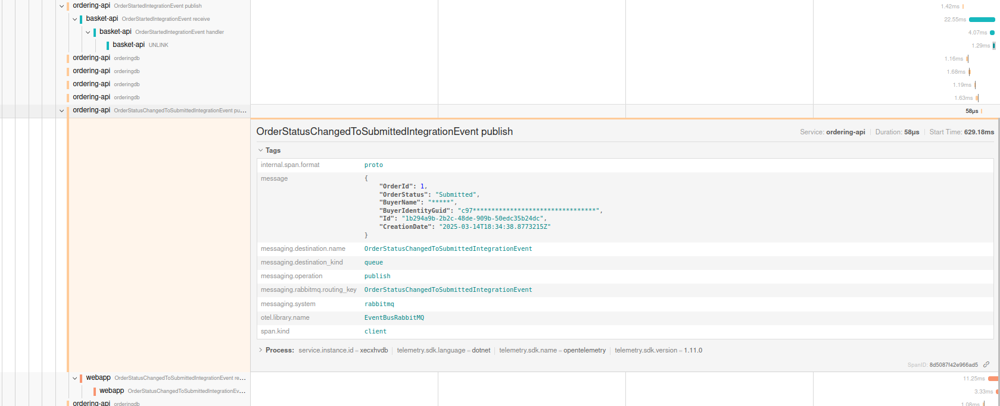

# Integrating OpenTelemetry & Security in eShop

## Initial Remarks
### Author and Github Repository
This work was carried out by **Miguel Figueiredo (NMec: 108287)** as part of the Software Architectures course curriculum. The repository that includes the implementation code can be found at the following link: [eShop_AS_108287](https://github.com/Migas77/eShop_AS_108287). If there is any issue regarding the implementations and contents of this record contact me through this email: 

### AI Contributions

As advised by the professor at the beginning of the project, when developing this project I took the opportunity to experiment with development tools integrated with AI, namely the cursor IDE. In this report, there is a section regarding my feedback and experiences regarding the use of this tool.

### How to build and run the eShop environment<br/>(including jaeger, prometheus and grafana)

I integrated Jaeger, Prometheus, and Grafana within .NET code by creating the respective containers. As a result, to run the application with full observability — beyond the Aspire dashboard already included form the initial solution — you simply need to execute the following command:

```powershell
dotnet run --project src/eShop.AppHost/eShop.AppHost.csproj
```
---

## Introduction

The goal of this project was to integrate OpenTelemetry tracing into a single feature of an [eShop e-commerce system](https://github.com/dotnet/eShop) while ensuring security best practices. The key objectives included:

  - **Implement OpenTelemetry tracing** on a single feature or use-case (end-to-end).
  - **Mask or exclude sensitive data** (e.g., email, payment details) from telemetry and logs.
  - **Set up a basic Grafana dashboard** to visualize the traces and metrics.
  - (Optional Extras) **Explore data encryption and compliance** in the database layer and introduce **column masking** for sensitive data

I've focused my implementation on the **checkout/place order feature**. The feature requires the user to be authenticated to place an order with the items that are present on the basket, which is stored server-side.

## Sequence Diagram - Checkout Flow
Before diving into the actual implementation is important to note the following sequence diagram highlighting the full flow of the **checkout/place order feature**.

**PLACE FULL FLOW HERE**

## Tracing 

Although the eCommerce application with an aspire implementation already provides a dashboard with the full list of resources, console, structured logs, **traces** and metrics, I've configured **Jaeger**, which is a distributed tracing platform. The configuration was achieved by the following code on [eShop.ServiceDefaults/Extensions.cs file](https://github.com/Migas77/eShop_AS_108287/blob/main/src/eShop.ServiceDefaults/Extensions.cs#L105). Bear in mind the configuration and specification of **CUSTOM_OTEL_EXPORTER_OTLP_ENDPOINT** environment variable present in the [eShop.AppHost/Properties/launchSettings.json file line 14](https://github.com/Migas77/eShop_AS_108287/blob/main/src/eShop.AppHost/Properties/launchSettings.json#L14), specifying the Jaeger OTel endpoint.

```c#
# eShop.ServiceDefaults/Extensions.cs
private static IHostApplicationBuilder AddOpenTelemetryExporters(this IHostApplicationBuilder builder)
{
  var useOtlpExporter = !string.IsNullOrWhiteSpace(builder.Configuration["OTEL_EXPORTER_OTLP_ENDPOINT"]);
  if (useOtlpExporter)
  {
    builder.Services.ConfigureOpenTelemetryLoggerProvider(logging => logging.AddProcessor<DataMaskingLogsProcessor>().AddOtlpExporter());
    builder.Services.ConfigureOpenTelemetryMeterProvider(metrics => metrics.AddOtlpExporter());
    builder.Services.ConfigureOpenTelemetryTracerProvider(tracing => tracing.AddProcessor<DataMaskingActivityProcessor>().AddOtlpExporter());
  }

  var useCustomOtlpExporter = !string.IsNullOrWhiteSpace(builder.Configuration["CUSTOM_OTEL_EXPORTER_OTLP_ENDPOINT"]);
  if (useCustomOtlpExporter)
  {   
    var endpoint = builder.Configuration["CUSTOM_OTEL_EXPORTER_OTLP_ENDPOINT"];
    builder.Services.ConfigureOpenTelemetryLoggerProvider(logging => logging.AddOtlpExporter(options => options.Endpoint = new Uri(endpoint!)));
    builder.Services.ConfigureOpenTelemetryTracerProvider(tracing => tracing.AddOtlpExporter(options => options.Endpoint = new Uri(endpoint!)));
    builder.Services.ConfigureOpenTelemetryMeterProvider(metrics => metrics.AddOtlpExporter(options => options.Endpoint = new Uri(endpoint!)));
  }

  builder.Services.ConfigureOpenTelemetryMeterProvider(metrics => metrics.AddPrometheusExporter());

  return builder;
}
``` 
```json
{
  "$schema": "http://json.schemastore.org/launchsettings.json",
  "profiles": {
    "https": {
      "commandName": "Project",
      "dotnetRunMessages": true,
      "launchBrowser": true,
      "applicationUrl": "https://localhost:19888;http://localhost:18848",
      "environmentVariables": {
        "ASPNETCORE_ENVIRONMENT": "Development",
        "DOTNET_ENVIRONMENT": "Development",
        "DOTNET_DASHBOARD_OTLP_ENDPOINT_URL": "https://localhost:18076",
        "DOTNET_RESOURCE_SERVICE_ENDPOINT_URL": "https://localhost:19076",
        "CUSTOM_OTEL_EXPORTER_OTLP_ENDPOINT": "http://localhost:4317"
      }
    }
  }
}
``` 

The Jaeger was configured to collect the traces, spans/activities and tags of all the application's services. The following images, showcase the full trace for the checkout use case. As the full trace is very extensive I've tried throghout the implementation to reuse already created activities for the new introduced tags. However, as you'll later see I've also added new activities. In this section, I'll make an explanation of the full checkout trace. I'll include images for easier explanation but the full trace exported from jaeger is also present [here](https://github.com/Migas77/eShop_AS_108287/blob/main/checkout-trace.json) if the reader wants to view it in its own dashboard.

The next figure, showcases **custom created tags related to the checkout process**: 
- basket.checkout.latency - latency of the checkout request/flow.
- basket.items - tuples regarding the state of the basket with (product_id, product_quantity, product_price).
- basket.items.unique.count - the number of different/unique items in the basket.
- basket.requestId - the requestId.
- basket.total - the total price of the basket.
- buyerId - the userId corresponding to the buyer. As you can see, the information for the buyerId is masked (c97*********************************). Later, the process of masking this and other tags will also be explained.

There are also other tags, already provided in the aspire implementation such as "url.path". It's also important to note the **use of events** to pinpoint/mark/record important events that provide additional context about what happened within the span's execution (in this case, I provide a simple event - "Get Basket Async").


The first part, of the trace is constitued by a POST request to the BasketApi.Basket/GetBasket endpoint. Yet again, there are defined custom tags basket.items and basket.items.unique.count, representing the id and quantity of each item in the basket and the number of different items in the basket respectively — these simple custom tags are present throghout the whole trace and, therefore, I'll refrain from mentioning them again so not to extend the size of this report. As previously, there are also defined two subsequent events showcasing when the get basket request was made and when an not empty basket was found.

At this image, it's possible to verify the **end-to-end nature of the trace**, which starts in the webapp, goes through the basket-api service and onto the redis database to retrieve the basket items.


At Figure 3, it's possible to observe the next steps of the checkout flow:
1. The webapp performs a request to the catalog-api to retrieve information about the purchased catalog items (tags catalog.ids and catalog.items). The trace also shows the request to the postgres catalogdb database, following the webapp initial request.
2. Then, the webapp performs a POST request on ordering-api's /api/orders endpoint to carry out the purchase. Following this request, there are two requests from the ordering-api to the identity-api. However, as these are not constant (not always present) throghout multiple checkout requests, I will not comment further on them. Next, it's shown a custom activity created by me for when a CreateOrderCommand is published. As the system's architecture and implementation includes an event bus, it's important to record creation, publication and receipt of Commands, Events and IntegrationEvents. In this CreateOrderCommand we can see once again custom tags with masking of userId tag. Span Events were also created and can be checked out on Figure 4


As mentioned previously, I think that's important to explicitely register all the events throughout the checkout process. The function AddDomainEvent present in the [Entity.cs file](https://github.com/Migas77/eShop_AS_108287/blob/main/src/Ordering.Domain/SeedWork/Entity.cs#L28) , was the ideal place to register all Domain Events. Once again, sensitive information as UserId, UserName, CardNumber and CardHolderName were also masked. Bear in mind that '*' corresponds to the used masking character and X was present on the credit card number of said user, as presented in the code snippet bellow and the following [file](https://github.com/Migas77/eShop_AS_108287/blob/main/src/Identity.API/UsersSeed.cs#L12).

At the image, we can also conclude that the OrderStartedDomainEvent (present in event.type tag) is catched by an handler is handled by an event handler (last trace), with the following events being registered: "Create new buyer", "Verify or add payment method" and "Add new buyer to repository".
	


```c# 
// Ordering.Domain/SeedWork/Entity.cs
public void AddDomainEvent(INotification eventItem)
{
  using var activity = _activitySource.StartActivity("AddDomainEvent");
  activity?.SetTag("event.type", eventItem.GetType().Name);
  activity?.SetTag("event.content", JsonConvert.SerializeObject(eventCopy));
  _domainEvents = _domainEvents ?? new List<INotification>();
  _domainEvents.Add(eventItem);
}
```

```c#
// Identity.API/UsersSeed.cs
alice = new ApplicationUser
{
  UserName = "alice",
  Email = "AliceSmith@email.com",
  EmailConfirmed = true,
  CardHolderName = "Alice Smith",
  CardNumber = "XXXXXXXXXXXX1881",
  CardType = 1,
  City = "Redmond",
  Country = "U.S.",
  Expiration = "12/24",
  Id = Guid.NewGuid().ToString(),
  LastName = "Smith",
  Name = "Alice",
  PhoneNumber = "1234567890",
  ZipCode = "98052",
  State = "WA",
  Street = "15703 NE 61st Ct",
  SecurityNumber = "123"
};
```


Other domain events and domain event handlers are traced, until the order is completed (has submitted state). Once this occurs, the ordering-api publishes OrderStartedIntegrationEvent to the rabbitmq event bus (Figure 5). This is also traced, as well as the receipt of the corresponding integration event on the basket-api. In both message tags, the userId value is also masked. This integration event is sent to the basket-api with the goal of deleting the basket. The integration event is then handled by a pre-configured handler, which is also traced (userId is once again masked). Afterwards, the deletion of the basket is carried out visible by the UNLINK Redis operation.


As the order is submitted, an OrderStatusChangedToSubmittedIntegrationEvent is sent through rabbitmq event bus, by the ordering-api to the webapp. Once again, PII information, such as BuyerName, BuyerIdentityGuid and buyerId are also masked.


Finally, the webapp makes a POST request to BasketAPI.Basket/DeleteBasket in order to delete the basket. As previously, this request is traced from the webapp until the REDIS database UNLINK operation.



As it's possible to conclude, the feature is traced end-to-end and full flow corresponds to the one highlighted on the sequence diagram.